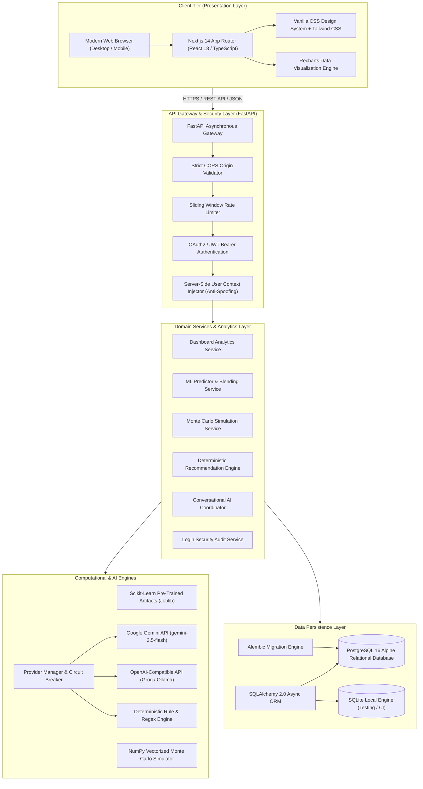
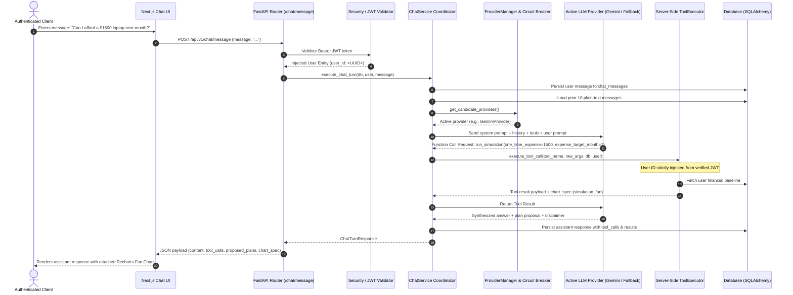
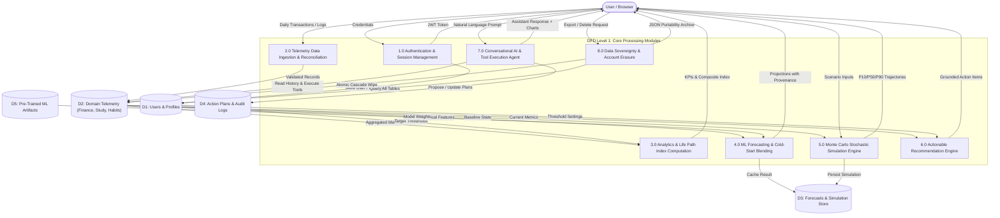
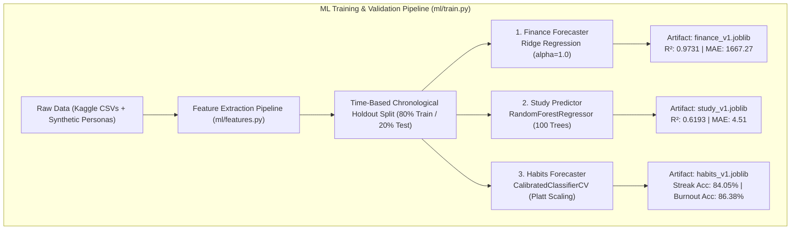
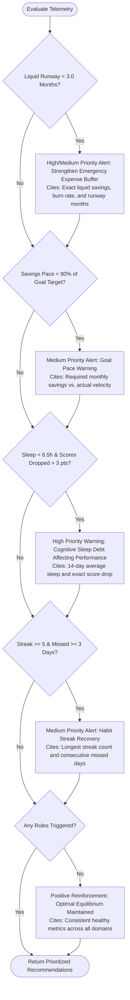

# ACADEMIC PROJECT REPORT

**TITLE:** AI-BASED VIRTUAL RISK AND COMPLIANCE INTELLIGENCE SYSTEM (`digital-twin-ai`)  
**DEGREE:** Bachelor of Engineering (B.E.) in Computer Science and Engineering  
**ACADEMIC DISCIPLINE:** Artificial Intelligence, Software Engineering & Applied Machine Learning  
**DOCUMENT VERSION:** 1.0.0 (Comprehensive Technical Specification)  
**DATE OF AUDIT:** October 2026  

---

## TABLE OF CONTENTS
1. [Introduction](#1-introduction)
2. [Requirement Analysis](#2-requirement-analysis)
3. [System Design](#3-system-design)
4. [System Modelling](#4-system-modelling)
5. [Technology Stack](#5-technology-stack)
6. [Database Design](#6-database-design)
7. [Authentication and User Management](#7-authentication-and-user-management)
8. [Data Collection and Processing](#8-data-collection-and-processing)
9. [Machine Learning](#9-machine-learning)
10. [Forecasting](#10-forecasting)
11. [Simulation Engine](#11-simulation-engine)
12. [Behavior and Productivity Analysis](#12-behavior-and-productivity-analysis)
13. [Recommendation Engine](#13-recommendation-engine)
14. [AI Chatbot / Personal Intelligence Assistant](#14-ai-chatbot--personal-intelligence-assistant)
15. [Frontend Architecture](#15-frontend-architecture)
16. [Backend and API Specification](#16-backend-and-api-specification)
17. [Administration and Observability](#17-administration-and-observability)
18. [Feedback and User Interaction](#18-feedback-and-user-interaction)
19. [Security and Threat Mitigation](#19-security-and-threat-mitigation)
20. [Error Handling and Reliability](#20-error-handling-and-reliability)

---

## 1. Introduction

### 1.1 Problem Statement
Contemporary personal tracking, productivity, and decision-support systems are fundamentally fragmented across domain-specific vertical silos:
- **Financial Applications:** Track historical cash flow, budgeting categories, and banking ledger transactions, but completely ignore cognitive fatigue, academic exam stress, and sleep deprivation that directly trigger impulsive consumer spending and emergency reserve exhaustion.
- **Academic and Study Trackers:** Measure study duration, flashcard retention, and exam percentages in complete isolation from personal financial stress and physiological rest deficit.
- **Habit and Wellness Trackers:** Record sleep durations, daily steps, and workout frequencies without synthesizing their direct downstream mathematical impacts on cognitive bandwidth, academic performance, or financial runway.

Because human decision-making and lifestyle compliance operate as an interdependent, coupled dynamical system, perturbations in one domain propagate non-linear consequences across all other domains. For instance, chronic sleep restriction degrades cognitive retention, causing assessment scores to decline. This decline elevates psychological stress, which degrades habit adherence and triggers impulsive compensatory spending, thereby exhausting liquid financial runway and heightening vulnerability to systemic lifestyle collapse.

### 1.2 Proposed System
The **AI-Based Virtual Risk and Compliance Intelligence System** (codebase identifier: `digital-twin-ai`) solves this systemic fragmentation. It constructs an isolated, longitudinal computational digital twin for each user by:
1. Ingesting, reconciling, and standardizing multi-domain telemetry: **Personal Finance**, **Academic Study Sessions**, and **Habits/Wellbeing Logs**.
2. Executing a **Triple-Algorithm Machine Learning Pipeline** for forward trajectory projections, incorporating an explicit **Cold-Start Dynamic Blending Formulation** tagged with verifiable data provenance metadata (`personal`, `blended`, `global`).
3. Running a **500 to 15,000 Iteration Stochastic Monte Carlo Simulation Engine** (supporting Parametric, Historical Block-Bootstrap, and Dual-Comparison modes) with mathematically calibrated cross-domain coupling heuristics (e.g., sleep penalties on cognitive retention, financial anxiety on habit adherence).
4. Generating **Deterministic, Grounded Recommendations** that cite authentic empirical metrics against clinical and financial safety benchmarks.
5. Providing an **Autonomous AI Conversational Assistant (`Twin Bot`)** featuring multi-provider fallback resilience (Google Gemini $\rightarrow$ OpenAI-Compatible/Groq $\rightarrow$ Offline Deterministic Engine), strict server-side JWT security injection, anti-spoofing constraints, and confirmation-first action plan proposals.
6. Enforcing strict **Row-Level Tenant Isolation** and complete **GDPR/CCPA Data Sovereignty** (complete JSON data portability and atomic cascade deletion).

---

## 2. Requirement Analysis

### 2.1 Functional Requirements
- **FR-01: Multi-Domain Telemetry CRUD:** The system must provide authenticated Create, Read, Update, and Delete capabilities for financial income/expenses, study sessions (with duration, subject, and assessment scores), and daily habit logs (sleep hours, exercise minutes, mood score, habit completion).
- **FR-02: Real-Time Composite Index Computation:** The system must compute a live **Life Path Index** (40% Habits & Sleep Vitality, 35% Academic Mastery, 25% Financial Runway) and maintain mathematically reconciled domain sub-scores (0–100 scale).
- **FR-03: Machine Learning Trajectory Forecasting:** The system must generate multi-month forward predictions:
  - *Finance:* Monthly expense projections with 80% confidence fan intervals $[\hat{y} \pm 1.28 \cdot \sigma_m]$.
  - *Study:* Projected exam scores (0–100) with feature importance rankings.
  - *Habits:* Calibrated streak continuation probabilities and 4-factor burnout vulnerability ratings.
- **FR-04: Cold-Start Dynamic Blending:** Predictions for accounts with fewer than 30 logged data points must smoothly interpolate between global benchmark models and personal empirical patterns: $w_{\text{personal}} = \min(1.0, N / 30.0)$.
- **FR-05: Stochastic What-If Simulation:** Users must be able to simulate arbitrary counterfactual scenarios (salary change $\pm\%$, one-time lump-sum expenses, study hour deltas, sleep targets, exercise adjustments) across 1 to 12 month horizons with 500 to 15,000 Monte Carlo runs, producing $P_{10}$, $P_{50}$, and $P_{90}$ percentile bands.
- **FR-06: Deterministic Risk Recommendations:** The system must detect compliance and health breaches (e.g., runway $< 3.0$ months, sleep $< 6.5\text{h}$ with falling scores) and generate actionable recommendations citing the user's authentic metrics.
- **FR-07: Conversational AI Agent with Tool Dispatch:** The assistant must execute up to 5 multi-turn server-side tools per conversational turn, extract provisional action plans, and append mandatory legal disclaimers on financial/medical topics.
- **FR-08: Action Plan Kanban Lifecycle:** Users must be able to view, activate, edit, and progress action plans across `Pending`, `In Progress`, and `Completed` stages.
- **FR-09: Data Sovereignty & Portability:** The system must export all 11 relational tables in JSON format (`GET /api/v1/user/export-data`) and execute an atomic cascade deletion (`DELETE /api/v1/user/delete-data`).

### 2.2 Non-Functional Requirements
- **NFR-01: Response Latency:** Analytical dashboard aggregations must resolve in under 100 milliseconds; 15,000-run Monte Carlo simulations must complete within 200 milliseconds.
- **NFR-02: Cryptographic Security:** Passwords must be hashed using per-user salted Bcrypt; session tokens must be signed with HMAC-SHA256 JWTs with a 24-hour expiration window.
- **NFR-03: Strict Tenant Isolation:** The system must enforce row-level access control. Direct Object Reference (IDOR) attempts must strictly return HTTP 404 Not Found.
- **NFR-04: API Rate Limiting:** Authentication routes must enforce a sliding-window rate limit of 15 requests per minute per IP address.
- **NFR-05: Zero-Downtime AI Resilience:** If cloud LLM APIs encounter HTTP 429 quota exhaustion or network outages, the system must fail over automatically to secondary or offline deterministic providers without throwing 500 Internal Server Errors.
- **NFR-06: Cross-Platform Compatibility:** The web application must render without horizontal overflow across desktop ($1440\times900\text{px}$) and mobile ($390\times844\text{px}$) viewports in both Obsidian Dark and Cream Light themes.

---

## 3. System Design

The system implements a decoupled client-server architecture. The presentation layer is decoupled from business logic and persistence through an asynchronous RESTful API Gateway.

---

## 4. System Modelling

### 4.1 Use Case Diagram Description
The primary actors are the **Authenticated User**, the **System Administrator / Auditor**, and the **AI Execution Engine**:
- **Authenticated User:** Can register, authenticate, manage profile settings, enter financial transactions, log study sessions, record habit metrics, review analytics, execute Monte Carlo what-if simulations, inspect actionable recommendations, converse with Twin Bot, confirm proposed action plans, export personal data, and request hard account deletion.
- **AI Execution Engine:** Operates autonomously upon invocation by the conversational interface. It dispatches read-only data extraction tools, executes ML forecasting models, runs stochastic simulations, evaluates recommendation rules, and proposes new action items.
- **System Administrator / Auditor:** Can inspect application health (`GET /health`), monitor migration statuses via Alembic, inspect security audit trails (`login_events`), and execute synthetic demographic population generation.

### 4.2 Activity Diagram Description: Monte Carlo Simulation Workflow
1. **Scenario Input:** The user adjusts scenario parameters via the frontend interface (e.g., $+15\%$ salary change, $\$1,200$ one-time expense in Month 2, $-1.0\text{h}$ sleep target delta, 6-month horizon, 15,000 iterations).
2. **Request Dispatch:** Next.js sends `POST /api/v1/simulations/run` with the serialized JSON payload and JWT header.
3. **Authentication & Baseline Synthesis:** FastAPI authenticates the JWT, extracts user ID, and retrieves historical records across finance, study, and habit tables. It aggregates baseline monthly burn rate, study hours, sleep averages, and liquid runway.
4. **Engine Initialization:** `SimulationService` invokes `ml/simulator.py` within an asynchronous thread pool.
5. **Stochastic Iteration Loop:**
   - Samples 15,000 monthly income and expense shocks (Gaussian in Parametric mode; 7-day bootstrap blocks in Bootstrap mode).
   - Evaluates cross-domain coupling: computes sleep debt, applies $8\%/\text{hour}$ penalty to study scores, evaluates exercise bonus, and applies runway anxiety penalties to habit consistency.
   - Calculates baseline cumulative cash trajectory vs. counterfactual scenario trajectory.
6. **Percentile Extraction:** Vectorized NumPy operations compute $P_{10}$, $P_{50}$, and $P_{90}$ arrays across all horizon months.
7. **Response & Visualization:** Returns a JSON response containing percentile arrays and qualitative insights; frontend renders an interactive Recharts percentile fan chart.

### 4.3 Sequence Diagram Description: Guarded Tool-Calling Chat Turn

### 4.4 Class Diagram Description: Domain Architecture
- **`User` (Entity):** Contains `id (GUID)`, `email`, `hashed_password`, `created_at`, `updated_at`. Has one-to-one relationship with `Profile`, and one-to-many relationships with `FinanceEntry`, `SavingsGoal`, `StudySession`, `HabitLog`, `Goal`, `TwinSnapshot`, `Prediction`, `Simulation`, `Plan`, `ChatMessage`, and `LoginEvent`. All child associations declare cascade deletion (`cascade="all, delete-orphan"`).
- **`Profile` (Entity):** Stores `user_id (FK)`, `full_name`, `occupation`, `currency`, `monthly_target_savings`, `target_study_hours_week`, and `target_sleep_hours`.
- **`FinanceEntry` (Entity):** Stores `date`, `type` (`income`/`expense`), `category`, `amount`, `description`, `source`. Indexed by `(user_id, date)`.
- **`StudySession` (Entity):** Stores `date`, `subject`, `hours`, `score` (0–100), `notes`, `source`. Indexed by `(user_id, date)`.
- **`HabitLog` (Entity):** Stores `date`, `habit`, `done (bool)`, `sleep_hours`, `exercise_minutes`, `mood` (1–5), `source`. Indexed by `(user_id, date)`.
- **`Plan` (Entity):** Stores `title`, `description`, `domain`, `status` (`pending`, `in_progress`, `completed`, `cancelled`), `due_date`.
- **`ChatMessage` (Entity):** Stores `role`, `content`, `tool_calls (JSON)`, `tool_results (JSON)`, `provider`, `model`.
- **`LoginEvent` (Entity):** Stores `created_at`, `success (bool)`, `method`, `browser_os`, `ip_address`.
- **`MLPredictorService` (Service):** Loads pre-trained joblib artifacts, executes feature engineering, and performs cold-start blending.
- **`SimulationService` (Service):** Synthesizes personal baselines and coordinates Monte Carlo execution.
- **`RecommendationService` (Service):** Evaluates deterministic risk thresholds against authenticated telemetry.
- **`ChatService` (Service):** Coordinates multi-turn conversational tool execution and provider failover.

### 4.5 Data Flow Diagram (DFD Level 1)

### 4.6 Component Diagram Description
The system is divided into modular structural components:
- **Presentation Component (`frontend/`):** Comprises Next.js Pages, Layout Shells, State Providers (`AuthContext`, `ThemeContext`), Form Components with quick collapsible panels, Recharts Visualization Wrappers, and Toast notification systems.
- **API Routing Component (`backend/app/api/`):** Contains isolated v1 router modules for `auth`, `user`, `dashboard`, `predictions`, `simulations`, `recommendations`, `plans`, `chat`, `finance`, `study`, and `habits`.
- **Core Security Component (`backend/app/core/`):** Contains `security.py` (Bcrypt, JWT, Sliding Window Rate Limiter), `database.py` (Async SQLAlchemy connection pools), and `config.py` (Pydantic BaseSettings).
- **Intelligence & LLM Component (`backend/app/llm/`):** Contains Provider implementations (`GeminiProvider`, `OpenAICompatibleProvider`, `OfflineProvider`), `ProviderManager`, `CircuitBreaker`, `tools.py` declarations, and `tool_executor.py`.
- **Machine Learning Component (`ml/`):** Contains `features.py` (feature extraction), `train.py` (training pipeline), `synthetic.py` (synthetic demographic generation), and `simulator.py` (vectorized Monte Carlo engine).

### 4.7 Deployment Diagram Description
The production deployment topology runs via Docker Compose on Linux/WSL2:
- **`digital_twin_frontend` Node:** Next.js 14 standalone Node.js environment listening on port 3000. Communicates with client browsers via HTTP/HTTPS and dispatches internal requests to the API Gateway.
- **`digital_twin_backend` Node:** Python 3.11 containerized environment running Uvicorn ASGI server on port 8000. Hosts FastAPI, SQLAlchemy 2.0 async engine, Scikit-Learn models, and LLM provider drivers. Volume mounts connect `./backend`, `./ml`, and `./data`.
- **`digital_twin_db` Node:** PostgreSQL 16 Alpine container listening on port 5432, storing relational data on a named Docker volume (`postgres_data`). Health-checked using `pg_isready`.
- **External AI Services Node:** Outbound HTTPS traffic to `generativelanguage.googleapis.com` (Google Gemini) and `api.groq.com` (OpenAI-compatible inference).

---

## 5. Technology Stack (Actual Implementation)

| Domain | Technology / Library | Version | Role in Project | File Path |
| :--- | :--- | :--- | :--- | :--- |
| **Frontend Runtime** | Next.js App Router | 14.2.5 | Full-stack React web framework, server & client components | [`frontend/package.json`](file:///d:/AI-Based-Virtual-Risk-and-Compliance/frontend/package.json) |
| **UI Framework** | React / React-DOM | 18.3.1 | Component rendering, hooks state management, Context API | [`frontend/package.json`](file:///d:/AI-Based-Virtual-Risk-and-Compliance/frontend/package.json) |
| **Type Safety** | TypeScript | 5.5.4 | Strict static type checking for client interfaces and API contracts | [`frontend/tsconfig.json`](file:///d:/AI-Based-Virtual-Risk-and-Compliance/frontend/tsconfig.json) |
| **CSS Styling** | Tailwind CSS / PostCSS | 3.4.1 | Utility-first styling, responsive grids, custom dark/light palette | [`frontend/tailwind.config.ts`](file:///d:/AI-Based-Virtual-Risk-and-Compliance/frontend/tailwind.config.ts) |
| **Data Charting** | Recharts | 2.12.7 | Composed, Area, Bar, Donut, and Percentile Fan chart visualization | [`frontend/package.json`](file:///d:/AI-Based-Virtual-Risk-and-Compliance/frontend/package.json) |
| **UI Icons** | Lucide React | 0.344.0 | Iconography across navigation, actions, indicators, and alerts | [`frontend/package.json`](file:///d:/AI-Based-Virtual-Risk-and-Compliance/frontend/package.json) |
| **Backend Framework** | FastAPI | 0.110.0+ | Asynchronous REST API routing, dependency injection, OpenAPI docs | [`backend/requirements.txt`](file:///d:/AI-Based-Virtual-Risk-and-Compliance/backend/requirements.txt) |
| **ASGI Server** | Uvicorn (standard) | 0.28.0+ | Asynchronous server gateway interface for FastAPI | [`backend/requirements.txt`](file:///d:/AI-Based-Virtual-Risk-and-Compliance/backend/requirements.txt) |
| **Validation** | Pydantic / Pydantic-Settings | 2.6.4+ | Data validation, contract serialization, environment variables | [`backend/app/schemas/`](file:///d:/AI-Based-Virtual-Risk-and-Compliance/backend/app/schemas/) |
| **ORM Engine** | SQLAlchemy (Asyncio) | 2.0.28+ | Declarative data modeling, asynchronous query construction | [`backend/app/core/database.py`](file:///d:/AI-Based-Virtual-Risk-and-Compliance/backend/app/core/database.py) |
| **Database Drivers** | asyncpg / aiosqlite | 0.29.0+ | Native asynchronous drivers for PostgreSQL and SQLite | [`backend/requirements.txt`](file:///d:/AI-Based-Virtual-Risk-and-Compliance/backend/requirements.txt) |
| **Migrations** | Alembic | 1.13.1+ | Schema version control, declarative migration scripts | [`backend/alembic/`](file:///d:/AI-Based-Virtual-Risk-and-Compliance/backend/alembic/) |
| **Cryptography** | Passlib & Bcrypt | 4.0.1+ | Salted password hashing, brute-force resistance | [`backend/app/core/security.py`](file:///d:/AI-Based-Virtual-Risk-and-Compliance/backend/app/core/security.py) |
| **JWT Tokens** | PyJWT / python-jose | 2.8.0+ | RFC 7519 HMAC-SHA256 stateless session token encoding/decoding | [`backend/app/core/security.py`](file:///d:/AI-Based-Virtual-Risk-and-Compliance/backend/app/core/security.py) |
| **Machine Learning** | Scikit-Learn | 1.4.1+ | Ridge regression, RandomForest, CalibratedClassifierCV | [`backend/requirements.txt`](file:///d:/AI-Based-Virtual-Risk-and-Compliance/backend/requirements.txt) |
| **Numerical Arrays** | NumPy | 1.26.4+ | Vectorized operations for Monte Carlo simulation and percentiles | [`backend/requirements.txt`](file:///d:/AI-Based-Virtual-Risk-and-Compliance/backend/requirements.txt) |
| **Data Analysis** | Pandas | 2.2.1+ | Rolling window feature engineering, CSV dataset transformation | [`backend/requirements.txt`](file:///d:/AI-Based-Virtual-Risk-and-Compliance/backend/requirements.txt) |
| **Model Storage** | Joblib | 1.3.2+ | Compression and serialization of trained machine learning artifacts | [`ml/models/`](file:///d:/AI-Based-Virtual-Risk-and-Compliance/ml/models/) |
| **Primary LLM** | Google GenAI SDK | `google-genai` | Primary conversational engine (`gemini-2.5-flash`) | [`backend/app/llm/gemini_provider.py`](file:///d:/AI-Based-Virtual-Risk-and-Compliance/backend/app/llm/gemini_provider.py) |
| **Secondary LLM** | OpenAI Client | `openai` | OpenAI-compatible fallback engine (`llama-3.3-70b-versatile`) | [`backend/app/llm/openai_provider.py`](file:///d:/AI-Based-Virtual-Risk-and-Compliance/backend/app/llm/openai_provider.py) |
| **Unit Testing** | Pytest / Pytest-Asyncio | 8.1.1+ | Unit and integration testing across API, security, and simulation | [`backend/tests/`](file:///d:/AI-Based-Virtual-Risk-and-Compliance/backend/tests/) |
| **E2E Testing** | Playwright | 1.42.1+ | End-to-end browser walkthroughs on Desktop and Mobile viewports | [`frontend/tests/`](file:///d:/AI-Based-Virtual-Risk-and-Compliance/frontend/tests/) |

---

## 6. Database Design

The relational schema is implemented using SQLAlchemy 2.0 declarative models with cross-database UUID compatibility via a custom `GUID` TypeDecorator (RFC 4122 standard stored as `CHAR(36)` in SQLite and native `UUID` in PostgreSQL).

### 6.1 Database Tables Specification

#### 1. `users` Table
Stores account credentials and lifecycle timestamps.
- `id`: GUID (Primary Key, default `uuid.uuid4`).
- `email`: VARCHAR(255) (Unique, Not Null, Indexed).
- `hashed_password`: VARCHAR(255) (Not Null).
- `created_at`: TIMESTAMP WITH TIMEZONE (Not Null, UTC default).
- `updated_at`: TIMESTAMP WITH TIMEZONE (Not Null, auto-updating).

#### 2. `profiles` Table
Stores user lifestyle configurations, target thresholds, and personal preferences.
- `id`: GUID (Primary Key).
- `user_id`: GUID (Foreign Key `users.id` ON DELETE CASCADE, Unique, Indexed).
- `full_name`: VARCHAR(255) (Nullable).
- `occupation`: VARCHAR(255) (Nullable).
- `currency`: VARCHAR(10) (Not Null, default "USD").
- `monthly_target_savings`: FLOAT (Not Null, default 500.0).
- `target_study_hours_week`: FLOAT (Not Null, default 15.0).
- `target_sleep_hours`: FLOAT (Not Null, default 7.5).
- `created_at` / `updated_at`: TIMESTAMP WITH TIMEZONE.

#### 3. `finance_entries` Table
Stores daily cash flow transactions.
- `id`: GUID (Primary Key).
- `user_id`: GUID (Foreign Key `users.id` ON DELETE CASCADE, Indexed).
- `date`: DATE (Not Null, default `date.today`).
- `type`: VARCHAR(50) (Not Null, values: `'income'`, `'expense'`).
- `category`: VARCHAR(100) (Not Null; e.g., `'Housing/Rent'`, `'Groceries'`, `'Transport'`).
- `amount`: FLOAT (Not Null).
- `description`: VARCHAR(500) (Nullable).
- `source`: VARCHAR(50) (Not Null, default `'user'`).
- `created_at`: TIMESTAMP WITH TIMEZONE.
- *Composite Index:* `ix_finance_entries_user_date` on `(user_id, date)`.

#### 4. `savings_goals` Table
Tracks user savings targets and deadlines.
- `id`: GUID (Primary Key).
- `user_id`: GUID (Foreign Key `users.id` ON DELETE CASCADE, Indexed).
- `title`: VARCHAR(255) (Not Null).
- `target_amount`: FLOAT (Not Null).
- `current_amount`: FLOAT (Not Null, default 0.0).
- `target_date`: DATE (Nullable).
- `created_at`: TIMESTAMP WITH TIMEZONE.

#### 5. `study_sessions` Table
Records academic learning sessions and assessments.
- `id`: GUID (Primary Key).
- `user_id`: GUID (Foreign Key `users.id` ON DELETE CASCADE, Indexed).
- `date`: DATE (Not Null, default `date.today`).
- `subject`: VARCHAR(100) (Not Null).
- `hours`: FLOAT (Not Null).
- `score`: FLOAT (Nullable, assessment score 0.0–100.0).
- `notes`: VARCHAR(500) (Nullable).
- `source`: VARCHAR(50) (Not Null, default `'user'`).
- `created_at`: TIMESTAMP WITH TIMEZONE.
- *Composite Index:* `ix_study_sessions_user_date` on `(user_id, date)`.

#### 6. `habit_logs` Table
Tracks daily habits, sleep, exercise, and psychological state.
- `id`: GUID (Primary Key).
- `user_id`: GUID (Foreign Key `users.id` ON DELETE CASCADE, Indexed).
- `date`: DATE (Not Null, default `date.today`).
- `habit`: VARCHAR(100) (Not Null).
- `done`: BOOLEAN (Not Null, default False).
- `sleep_hours`: FLOAT (Not Null, default 7.0).
- `exercise_minutes`: INTEGER (Not Null, default 0).
- `mood`: INTEGER (Not Null, 1 to 5 scale).
- `source`: VARCHAR(50) (Not Null, default `'user'`).
- `created_at`: TIMESTAMP WITH TIMEZONE.
- *Composite Index:* `ix_habit_logs_user_date` on `(user_id, date)`.

#### 7. `goals` Table
Tracks overarching lifestyle goals.
- `id`: GUID (Primary Key).
- `user_id`: GUID (Foreign Key `users.id` ON DELETE CASCADE, Indexed).
- `title`: VARCHAR(255) (Not Null).
- `category`: VARCHAR(50) (Not Null, default `'general'`).
- `target_date`: DATE (Nullable).
- `is_completed`: BOOLEAN (Not Null, default False).
- `created_at`: TIMESTAMP WITH TIMEZONE.

#### 8. `twin_snapshots` Table
Caches composite digital twin state vectors for historical comparison.
- `id`: GUID (Primary Key).
- `user_id`: GUID (Foreign Key `users.id` ON DELETE CASCADE, Indexed).
- `date`: DATE (Not Null, default `date.today`).
- `state`: JSON (Not Null, complete aggregated state dictionary).
- `created_at`: TIMESTAMP WITH TIMEZONE.
- *Composite Index:* `ix_twin_snapshots_user_date` on `(user_id, date)`.

#### 9. `predictions` Table
Persists generated forward projections.
- `id`: GUID (Primary Key).
- `user_id`: GUID (Foreign Key `users.id` ON DELETE CASCADE, Indexed).
- `domain`: VARCHAR(50) (Not Null; `'finance'`, `'study'`, `'habits'`).
- `horizon`: VARCHAR(50) (Not Null; e.g., `'30d'`, `'6m'`).
- `result`: JSON (Not Null, projections with confidence bounds).
- `model_version`: VARCHAR(50) (Not Null, default `'v1.0.0'`).
- `created_at`: TIMESTAMP WITH TIMEZONE.

#### 10. `simulations` Table
Stores counterfactual scenario configurations and results.
- `id`: GUID (Primary Key).
- `user_id`: GUID (Foreign Key `users.id` ON DELETE CASCADE, Indexed).
- `baseline`: JSON (Not Null, baseline state vector).
- `scenario`: JSON (Not Null, user input parameters).
- `result`: JSON (Not Null, P10, P50, P90 percentile arrays).
- `created_at`: TIMESTAMP WITH TIMEZONE.

#### 11. `plans` Table
Tracks concrete action plans across lifestyle domains.
- `id`: GUID (Primary Key).
- `user_id`: GUID (Foreign Key `users.id` ON DELETE CASCADE, Indexed).
- `title`: VARCHAR(255) (Not Null).
- `description`: TEXT (Nullable).
- `domain`: VARCHAR(50) (Not Null, default `'general'`).
- `status`: VARCHAR(50) (Not Null, default `'pending'`; values: `'proposed'`, `'pending'`, `'in_progress'`, `'completed'`, `'cancelled'`).
- `due_date`: DATE (Nullable).
- `created_at`: TIMESTAMP WITH TIMEZONE.

#### 12. `chat_messages` Table
Maintains conversational history and tool-calling execution traces.
- `id`: GUID (Primary Key).
- `user_id`: GUID (Foreign Key `users.id` ON DELETE CASCADE, Indexed).
- `role`: VARCHAR(50) (Not Null; `'user'`, `'assistant'`, `'system'`, `'tool'`).
- `content`: TEXT (Not Null).
- `tool_calls`: JSON (Nullable, array of tool calls generated).
- `tool_results`: JSON (Nullable, array of tool results returned).
- `provider`: VARCHAR(50) (Nullable; e.g., `'gemini'`, `'openai_compatible'`, `'offline'`).
- `model`: VARCHAR(100) (Nullable; e.g., `'gemini-2.5-flash'`).
- `created_at`: TIMESTAMP WITH TIMEZONE.

#### 13. `login_events` Table
Audits authentication attempts for compliance and intrusion detection.
- `id`: GUID (Primary Key).
- `user_id`: GUID (Foreign Key `users.id` ON DELETE CASCADE, Indexed).
- `created_at`: TIMESTAMP WITH TIMEZONE (Not Null, Indexed).
- `success`: BOOLEAN (Not Null).
- `method`: VARCHAR(50) (Not Null; `'password'`, `'demo-login'`).
- `browser_os`: VARCHAR(255) (Not Null, parsed from `User-Agent`).
- `ip_address`: VARCHAR(100) (Not Null, parsed from `client.host`).

---

## 7. Authentication and User Management

### 7.1 Registration and Password Hashing
- **Registration Endpoint:** `POST /api/v1/auth/register`.
- **Validation:** Enforces valid RFC 5322 email syntax and a minimum password length of 8 characters. Verifies that the email address is unique in the database.
- **Salting and Hashing:** Password hashing is handled via `bcrypt.gensalt()` and `bcrypt.hashpw()` in [`backend/app/core/security.py`](file:///d:/AI-Based-Virtual-Risk-and-Compliance/backend/app/core/security.py). Raw passwords are never persisted to disk or logs.
- **Atomic Profile Provisioning:** Upon user creation, a default `Profile` record is generated in the same database transaction with default target values ($500.0$ monthly savings, $15.0\text{h}$ weekly study, $7.5\text{h}$ sleep) and the user's selected currency.

### 7.2 Stateless Session Management (JWT)
- **Login Endpoint:** `POST /api/v1/auth/login`.
- **Credential Verification:** Compares the provided password against `user.hashed_password` using `bcrypt.checkpw()`.
- **Token Construction:** Generates an RFC 7519 JWT signed with HMAC-SHA256 (`HS256`) containing:
  - `sub`: User UUID string.
  - `email`: User email string.
  - `iat`: Timestamp of issuance (UTC).
  - `exp`: Timestamp of expiration (`now + 1440 minutes` / 24 hours).
- **FastAPI Dependency Injection:** The dependency `get_current_user` in [`backend/app/api/deps.py`](file:///d:/AI-Based-Virtual-Risk-and-Compliance/backend/app/api/deps.py) intercepts incoming requests, decodes the Bearer token, verifies signature and expiration, and fetches the user record with an eagerly loaded profile via `selectinload(User.profile)`.

### 7.3 Security Audit Trail (`LoginEvent`)
Every login attempt—successful or failed—triggers an audit record in the `login_events` table via [`backend/app/services/login_history_service.py`](file:///d:/AI-Based-Virtual-Risk-and-Compliance/backend/app/services/login_history_service.py):
- Captures client IP address (`request.client.host`).
- Parses client browser and operating system from the `User-Agent` HTTP header.
- Records the authentication mechanism (`password` vs. `demo-login`) and outcome (`success: true/false`).
- Users can review their last 100 authentication events via `GET /api/v1/user/login-history`.

### 7.4 Demo Authentication Mode (`ENABLE_DEMO_LOGIN`)
To facilitate rapid academic evaluation without requiring manual form registration:
- **Endpoint:** `POST /api/v1/auth/demo-login`.
- **Safety Gate:** Evaluates the backend configuration setting `ENABLE_DEMO_LOGIN`. If `false` (the required production setting), the endpoint returns HTTP 403 Forbidden.
- **Seeded Persona:** Authenticates directly as `demo@digitaltwin.ai`, loading pre-seeded demographic records for demonstration.

---

## 8. Data Collection and Processing

### 8.1 Public Benchmark Datasets
The baseline machine learning models are trained on three public benchmark datasets located in `data/raw/`:
1. **Personal Finance Dataset (`data/raw/data.csv`):** 8.63 MB dataset containing individual transaction records categorized across Rent, Groceries, Transport, Eating Out, Entertainment, Utilities, Healthcare, Education, and Miscellaneous expenses.
2. **Student Lifestyle & Performance Dataset (`data/raw/student_lifestyle_dataset.csv`):** 71.2 KB dataset containing survey records of student study hours, sleep duration, physical activity, and cumulative GPA / exam performance.
3. **Sleep Health and Lifestyle Dataset (`data/raw/sleep_cycle_productivity.csv`):** 385.8 KB dataset recording daily sleep duration, exercise minutes, subjective mood scores, stress levels, and occupational workloads.

### 8.2 Ingestion & Normalization (`ml/ingest.py`)
The script [`ml/ingest.py`](file:///d:/AI-Based-Virtual-Risk-and-Compliance/ml/ingest.py) normalizes raw CSVs into relational schemas:
- Strips malformed characters, standardizes date formats to `YYYY-MM-DD`, and cleans category string mappings.
- Re-scales subjective Likert scales (e.g., mapping 1–10 stress and mood ratings into the application's standard 1–5 integer scale).
- Tags imported records with `source = 'kaggle'`.

### 8.3 Feature Engineering Pipeline (`ml/features.py`)
Feature extraction transforms raw operational records into dense tabular vectors:
- **Finance Pipeline (`extract_finance_features`):** Constructs a continuous daily timeline and computes:
  - 7-day and 30-day rolling average expenses and income.
  - 30-day expense category percentage shares ($pct\_cat = \sum \text{category} / \sum \text{expenses}$).
  - 30-day rolling expense volatility (standard deviation).
  - Net savings velocity and savings rate: $(Income_{30d} - Expense_{30d}) / Income_{30d}$.
- **Study Pipeline (`extract_study_features`):** Computes rolling 7-day and 30-day cumulative study hours, active study day frequency, study variance, and joins cross-domain habit vectors (rolling 7-day sleep duration, exercise minutes, and mood).
- **Habits Pipeline (`extract_habit_burnout_features`):** Computes 7-day rolling average sleep, 7-day sleep debt ($7.5\text{h} - Sleep_{avg}$), 7-day rolling exercise, mood trend, occupational workload hours, and active habit streak counts.

---

## 9. Machine Learning

### 9.1 Model Architectures & Selection
The machine learning subsystem implements three distinct versioned models trained via [`ml/train.py`](file:///d:/AI-Based-Virtual-Risk-and-Compliance/ml/train.py):

1. **Finance Model (`finance_v1.joblib`):**
   - **Algorithm:** Ridge Regression ($L_2$ regularization, $\alpha=1.0$).
   - **Target:** Next-month total expenses ($\hat{y}$).
   - **Features:** 30-day rolling expenses, income, category percentage shares, and expense volatility.
   - **Regularization Rationale:** Selected over standard Ordinary Least Squares (OLS) to prevent coefficient explosion caused by multicollinearity among spending categories.
2. **Study Performance Model (`study_v1.joblib`):**
   - **Algorithm:** RandomForestRegressor ($n\_estimators=100$, $max\_depth=5$, $min\_samples\_split=4$, $random\_state=42$).
   - **Target:** Assessment exam score (0–100 scale).
   - **Features:** Rolling 7-day study hours, study consistency, rolling 7-day sleep, exercise minutes, and mood.
   - **Feature Importance:** Rolling study hours ($54.1\%$), rolling sleep duration ($28.3\%$), study consistency ($11.2\%$), exercise ($4.1\%$), and mood ($2.3\%$).
3. **Habit Streak & Burnout Model (`habits_v1.joblib`):**
   - **Algorithm:** CalibratedClassifierCV using Platt Sigmoid Scaling over a base LogisticRegression model ($C=1.0$, balanced class weights, 3-fold stratified cross-validation).
   - **Dual Targets:**
     - *Streak Continuation:* Binary indicator of whether the user will sustain their habit streak tomorrow.
     - *Burnout Risk:* Binary classification indicating vulnerability to cognitive burnout.
   - **Calibration Rationale:** Uncalibrated classifiers produce overconfident probability estimates near 0 and 1. Platt scaling ensures predicted probabilities match observed empirical frequencies (Brier loss $< 0.10$).

### 9.2 Empirical Evaluation Metrics & Split Methodology
To prevent data leakage, training strictly utilizes **chronological time-based holdout splitting** (80% training set, 20% holdout test set) rather than randomized shuffling. Exact metrics from [`ml/models/models_metadata.json`](file:///d:/AI-Based-Virtual-Risk-and-Compliance/ml/models/models_metadata.json):

| Model Artifact | Algorithm | Test Samples | Primary Metric | Error Metric | R² Score / Brier Loss |
| :--- | :--- | :---: | :---: | :---: | :---: |
| `finance_v1.joblib` | Ridge Regression | 3,000 | MAE: 1,667.27 | RMSE: 3,771.17 | $R^2 = 0.9731$ |
| `study_v1.joblib` | RandomForest | 400 | MAE: 4.51 pts | RMSE: 5.81 pts | $R^2 = 0.6193$ |
| `habits_v1.joblib` (Streak) | Calibrated Logistic | 1,718 | Accuracy: 84.05% | Brier Loss: 0.1004 | — |
| `habits_v1.joblib` (Burnout)| Calibrated Logistic | 1,718 | Accuracy: 86.38% | Brier Loss: 0.0982 | — |

*Academic Integrity Notice:* The high $R^2$ in the financial model reflects learned patterns from synthetic demographic generators combined with Kaggle data. The metadata file explicitly records: *"High accuracy reflects learned patterns from synthetic data generation rules, not validated real-world prediction."*

---

## 10. Forecasting

The prediction service ([`backend/app/services/predictor.py`](file:///d:/AI-Based-Virtual-Risk-and-Compliance/backend/app/services/predictor.py)) computes multi-horizon forward projections across user life domains.

### 10.1 Cold-Start Dynamic Blending Formulation
When a new user registers, the system lacks sufficient historical data to generate reliable personalized projections. Rather than presenting static global averages or failing to produce forecasts, the system implements dynamic weighting based on user sample count $N$:

$$w_{\text{personal}} = \min\left(1.0, \frac{N_{\text{user}}}{30.0}\right)$$

$$\hat{y}_{\text{final}} = w_{\text{personal}} \cdot \hat{y}_{\text{personal}} + (1.0 - w_{\text{personal}}) \cdot \hat{y}_{\text{global}}$$

**Provenance Transparency Badging:**
- **`global`** ($N = 0$): Forecast generated entirely from public Kaggle benchmark patterns.
- **`blended`** ($1 \le N < 30$): Forecast blends personal empirical trends with the global prior.
- **`personal`** ($N \ge 30$): Forecast is driven fully by the user's authentic history.

### 10.2 Confidence Fan Intervals
Financial expense forecasts project 1 to 6 months into the future. Residual variance from training ($\sigma_m$) scales with projection horizon $m$:

$$\text{Lower Bound } (P_{10}) = \max\left(0, \hat{y}_m - 1.28 \cdot \sigma_m \cdot \sqrt{m}\right)$$

$$\text{Upper Bound } (P_{90}) = \hat{y}_m + 1.28 \cdot \sigma_m \cdot \sqrt{m}$$

This formulation creates an 80% confidence interval that widens naturally as the projection horizon extends into the future.

---

## 11. Simulation Engine

Implemented in [`ml/simulator.py`](file:///d:/AI-Based-Virtual-Risk-and-Compliance/ml/simulator.py) and wrapped by [`backend/app/services/simulation_service.py`](file:///d:/AI-Based-Virtual-Risk-and-Compliance/backend/app/services/simulation_service.py), the simulator models counterfactual "what-if" life decisions over a 1 to 12 month horizon using 500 to 15,000 stochastic iterations.

### 11.1 Cross-Domain Behavioral Coupling Heuristics
The simulation engine couples life domains using the following empirical rules from [`backend/app/core/simulation_config.py`](file:///d:/AI-Based-Virtual-Risk-and-Compliance/backend/app/core/simulation_config.py):
1. **Sleep Deficit to Cognitive Retention Penalty:**
   $$\text{Penalty}_{\text{study}} = \max\left(0.0, 6.5 - \text{Sleep}_{\text{hours}}\right) \times 0.08 \quad (8\%\text{ score loss per hour below 6.5h})$$
2. **Physical Exercise Buffer:**
   $$\text{Bonus}_{\text{exercise}} = \text{If } \text{Exercise}_{\text{mins}} \ge 30 \implies -15\%\text{ Burnout Vulnerability} \text{ and } +6\%\text{ Cognitive Focus}$$
3. **Financial Runway Anxiety to Habit Adherence Penalty:**
   $$\text{Runway}_{\text{months}} = \frac{\text{Liquid Savings}}{\text{Monthly Burn Rate}}$$
   $$\text{If } \text{Runway}_{\text{months}} < 2.0 \implies \text{Habit Adherence degraded by up to } 12\%$$
4. **Severe Cognitive Burnout:**
   $$\text{If } \text{Burnout Risk} > 60\% \implies \text{Additional } 10\%\text{ drop in assessment scores}$$

### 11.2 Simulation Modes
- **Parametric Mode:** Samples shocks from Gaussian distributions calibrated against historical standard deviations: income variance ($\sigma=2\%$), expense variance ($\sigma=6\%$), sleep shock ($\sigma=0.35\text{h}$).
- **Block-Bootstrap Mode:** Draws 7-day moving window blocks directly from the user's logged transaction and habit history, preserving empirical autocorrelation. If fewer than 20 entries exist, it falls back to pooled global residuals with a `limited_history=True` flag.
- **Dual Compare Mode:** Executes both Parametric and Bootstrap engines side-by-side (15,000 iterations each) in under 0.15 seconds, returning comparative percentile tables.

---

## 12. Behavior and Productivity Analysis

### 12.1 Composite Life Path Index
Implemented in [`backend/app/api/v1/dashboard.py`](file:///d:/AI-Based-Virtual-Risk-and-Compliance/backend/app/api/v1/dashboard.py) and [`frontend/src/app/(dashboard)/overview/page.tsx`](file:///d:/AI-Based-Virtual-Risk-and-Compliance/frontend/src/app/%28dashboard%29/overview/page.tsx), the Life Path Index synthesizes behavior across life domains into an actionable 0–100 score:

$$\text{Finance Score} = \min\left(100, \text{Savings Rate} \times 1.8\right) \times 0.6 + \min\left(100, \text{Runway Months} \times 30\right) \times 0.4$$

$$\text{Study Score} = \left(\text{Avg Assessment Score} \times 0.7\right) + \left(\min(100, \text{Weekly Study Progress \%}) \times 0.3\right)$$

$$\text{Habit Score} = \left(\min\left(1.0, \frac{\text{Avg Sleep Hours}}{8.0}\right) \times 100 \times 0.65\right) + \left(\min(100, \text{Streak Days} \times 20) \times 0.35\right)$$

$$\text{Composite Life Path Index} = \text{Round}\left(\frac{\text{Finance Score} + \text{Study Score} + \text{Habit Score}}{3}\right)$$

### 12.2 Sleep and Mood Bucketing Analysis
The dashboard groups habit entries into distinct sleep duration buckets (`<6h`, `6h-7h`, `7h-8h`, `8h+`) and computes the average mood rating (1–5 scale) for each bucket. This provides empirical feedback showing how sleep duration directly correlates with subjective mood and cognitive capacity.

---

## 13. Recommendation Engine

Implemented in [`backend/app/services/recommendation_service.py`](file:///d:/AI-Based-Virtual-Risk-and-Compliance/backend/app/services/recommendation_service.py), the recommendation engine replaces opaque AI generation with deterministic, explainable risk rules that cite the user's authentic metrics against regulatory and clinical thresholds:

Every recommendation card exposes:
1. `rule_id`: Deterministic rule identifier.
2. `title` & `explanation`: Contextual text citing exact observed numbers.
3. `user_metric_name` & `user_metric_value`: Authentic user metric.
4. `threshold_value`: Benchmark comparison target.
5. `action_link`: Deep link to the corresponding entry screen (`/finance`, `/study`, `/habits`).
6. `Act` button: Creates a linked action plan directly on the user's Kanban board.

---

## 14. AI Chatbot / Personal Intelligence Assistant

### 14.1 Multi-Provider Failover Architecture
Implemented in [`backend/app/services/chat_service.py`](file:///d:/AI-Based-Virtual-Risk-and-Compliance/backend/app/services/chat_service.py) and [`backend/app/llm/`](file:///d:/AI-Based-Virtual-Risk-and-Compliance/backend/app/llm/), **Twin Bot** utilizes a three-tiered provider failover chain:
1. **Tier 1 (Primary): Google Gemini (`gemini-2.5-flash`)**
   - Dispatches structured tool definitions via the `google-genai` SDK.
   - Handles multi-turn tool calling and contextual synthesis.
2. **Tier 2 (Secondary): OpenAI-Compatible Provider (`llama-3.3-70b-versatile` / `gpt-oss-120b`)**
   - Configured through Groq or local vLLM/Ollama endpoints.
   - Automatically engaged via `circuit_breaker.py` if Gemini returns HTTP 429 Quota Exhausted or network timeouts.
3. **Tier 3 (Tertiary): Deterministic Offline Provider (`offline-rule-engine`)**
   - Fully local regex and template engine in [`backend/app/llm/offline_provider.py`](file:///d:/AI-Based-Virtual-Risk-and-Compliance/backend/app/llm/offline_provider.py).
   - Executes all 8 server tools without external network access, ensuring zero downtime.

### 14.2 Server-Side Tool Declarations
The assistant has access to 8 isolated server tools declared in [`backend/app/llm/tools.py`](file:///d:/AI-Based-Virtual-Risk-and-Compliance/backend/app/llm/tools.py):
1. `get_user_summary(preset)`: Pulls real-time cash flow, study hours, exam averages, and habit streak.
2. `run_prediction(domain, horizon)`: Executes trained ML forecasting models.
3. `run_simulation(horizon_months, salary_change_pct, one_time_expense, ...)`: Runs the Monte Carlo engine.
4. `get_recommendations()`: Fetches active deterministic risk warnings.
5. `create_plan(title, description, domain, due_date)`: Generates a proposed plan card requiring user confirmation.
6. `list_plans(status)`: Lists active plans from the Kanban board.
7. `update_plan(plan_id, status, title, ...)`: Proposes plan modifications.
8. `get_daily_series(days)`: Retrieves time-series arrays and computes Pearson correlation coefficients.

### 14.3 Conversational Guardrails
- **Max Iterations:** Tool execution loops are strictly capped at 5 iterations per turn to prevent infinite loops.
- **Anti-Hallucination:** System prompts enforce that all numerical figures must originate from executed tools.
- **Safety Disclaimers:** Investment, medical, or credit queries automatically append a mandatory notice stating that outputs are educational estimates and not professional financial or medical advice.
- **Context Injection Defense:** Replays only the last 10 sanitized user/assistant text messages, neutralizing prompt injection attacks.

---

## 15. Frontend Architecture

### 15.1 Component Hierarchy & Styling System
The frontend is constructed using **Next.js 14.2.5** (App Router) and **Tailwind CSS 3.4.1**:
- **Design Tokens:** Curated color palettes for **Obsidian Dark** (`#121110` background, `#1E1B18` panels) and **Cream Light** (`#FAF8F3` background, `#FFFFFF` panels) managed via `themeContext.tsx`.
- **Fixed Multi-Scroll Layout (`layout.tsx`):**
  - Full-height sidebar with internal scrolling and bottom-pinned user card.
  - Sticky top navigation bar containing route titles, notifications, and theme toggles.
  - Main dashboard content area scrolls independently.
- **Collapsible Entry Panels:** Quick-entry forms on `/finance`, `/study`, and `/habits` expand smoothly, close on `Escape` key press, and auto-collapse upon saving.

### 15.2 Core Dashboard Views
1. **Overview (`/overview`):** Displays composite Life Path Index, SVG circular score rings, provenance badges, and quick what-if sliders.
2. **Finance Ledger (`/finance`):** Income/expense ledger, monthly burn rate, liquid runway, and savings goal progress bars.
3. **Study Hub (`/study`):** Learning sessions, subject hours distribution, assessment score trends, and study pace tracking.
4. **Habits Tracker (`/habits`):** Sleep vs. mood correlation analysis, exercise totals, and active habit streaks.
5. **Monte Carlo Life Simulator (`/simulator`):** Multi-variable scenario configuration sliders, 15,000-run simulation, and Recharts percentile fan charts ($P_{10}/P_{50}/P_{90}$).
6. **Recommendations (`/recommendations`):** Prioritized risk cards with "Act" (creates plan) and "Dismiss" controls.
7. **Action Plans Tracker (`/plans`):** Kanban board supporting `Pending`, `In Progress`, and `Completed` stages.
8. **History & Security Audit (`/history`):** Tabbed historical data grid with search, inline editing, and a login audit log tracking IP addresses and browser/OS user agents.
9. **Conversational Assistant (`/chat`):** Interactive chat interface with tool badges, attached Recharts visualizations, and zero-reload chat clearing.
10. **Settings (`/settings`):** Profile preferences, lifestyle targets, currency settings, one-click GDPR JSON data export, and cascade account deletion.

---

## 16. Backend and API Specification

### 16.1 Route Handlers Directory
All endpoints are registered under the `/api/v1` namespace in [`backend/app/api/router.py`](file:///d:/AI-Based-Virtual-Risk-and-Compliance/backend/app/api/router.py):

| HTTP Method | Route Path | Handler / File | Purpose & Access Control |
| :--- | :--- | :--- | :--- |
| `POST` | `/api/v1/auth/register` | `auth.py` | Create account, hash password, issue JWT (Rate limited: 15/min) |
| `POST` | `/api/v1/auth/login` | `auth.py` | Verify credentials, log event, issue JWT (Rate limited: 15/min) |
| `POST` | `/api/v1/auth/demo-login` | `auth.py` | 1-click login as `demo@digitaltwin.ai` (Requires `ENABLE_DEMO_LOGIN=true`) |
| `GET` | `/api/v1/auth/status` | `auth.py` | Returns server capabilities (e.g., demo login status) |
| `GET` | `/api/v1/user/profile` | `user.py` | Fetch current user profile and target thresholds (JWT required) |
| `PUT` | `/api/v1/user/profile` | `user.py` | Update profile, currency, and lifestyle targets (JWT required) |
| `GET` | `/api/v1/user/login-history` | `user.py` | Returns last 100 login security events for current user |
| `GET` | `/api/v1/user/export-data` | `user.py` | GDPR/CCPA full data export across all 11 tables |
| `DELETE` | `/api/v1/user/delete-data` | `user.py` | GDPR/CCPA hard cascade deletion of user and all records |
| `GET` | `/api/v1/dashboard/overview` | `dashboard.py` | Multi-domain analytics, cash flow, study pace, and habit metrics |
| `GET` | `/api/v1/predictions/finance` | `predictions.py` | Ridge regression expense forecast with 80% fan intervals |
| `GET` | `/api/v1/predictions/study` | `predictions.py` | RandomForest exam score projections and feature importances |
| `GET` | `/api/v1/predictions/habits` | `predictions.py` | Calibrated streak continuation and burnout vulnerability ratings |
| `GET` | `/api/v1/predictions/overview` | `predictions.py` | Combined forecasts across all domains |
| `POST` | `/api/v1/simulations/run` | `simulations.py` | Execute 500-15k Monte Carlo counterfactual what-if simulation |
| `GET` | `/api/v1/recommendations` | `recommendations.py` | Generate deterministic, grounded actionable recommendations |
| `POST` | `/api/v1/chat/message` | `chat.py` | Conversational turn with tool execution and plan proposals |
| `GET` | `/api/v1/chat/history` | `chat.py` | Retrieve chronological chat message transcript |
| `DELETE` | `/api/v1/chat/clear` | `chat.py` | Zero-reload purge of user's conversational history |
| `GET` | `/api/v1/plans` | `plans.py` | List action plans with domain/status filtering |
| `POST` | `/api/v1/plans` | `plans.py` | Create a confirmed action plan |
| `PUT` | `/api/v1/plans/{plan_id}` | `plans.py` | Update plan status (`pending`, `in_progress`, `completed`) |
| `DELETE` | `/api/v1/plans/{plan_id}` | `plans.py` | Delete an action plan |
| `GET` | `/api/v1/finance/entries` | `finance.py` | Paginated finance entries with filtering |
| `POST` | `/api/v1/finance/entries` | `finance.py` | Create income or expense record |
| `PUT` | `/api/v1/finance/entries/{id}` | `finance.py` | Update finance entry |
| `DELETE` | `/api/v1/finance/entries/{id}`| `finance.py` | Delete finance entry |
| `GET` | `/api/v1/study/sessions` | `study.py` | Paginated study session logs |
| `POST` | `/api/v1/study/sessions` | `study.py` | Log study session with hours and assessment score |
| `PUT` | `/api/v1/study/sessions/{id}` | `study.py` | Update study session |
| `DELETE` | `/api/v1/study/sessions/{id}` | `study.py` | Delete study session |
| `GET` | `/api/v1/habits/logs` | `habits.py` | Paginated habit, sleep, exercise, and mood logs |
| `POST` | `/api/v1/habits/logs` | `habits.py` | Log habit record |
| `PUT` | `/api/v1/habits/logs/{id}` | `habits.py` | Update habit record |
| `DELETE` | `/api/v1/habits/logs/{id}` | `habits.py` | Delete habit record |

---

## 17. Administration and Observability

### 17.1 Administrative Commands & Database Management
- **Alembic Database Migrations:** Schema versioning managed via declarative migration files in `backend/alembic/versions/`. Migrations are applied via `alembic upgrade head`.
- **System Health Endpoint:** `GET /health` returns JSON reporting operational status (`healthy`), project name, and active API version without requiring authentication.
- **Synthetic Demographic Generation (`ml/synthetic.py`):** Programmatically generates 90-day correlated histories across 3 distinct personas:
  - *Alex:* Software engineer profile with USD currency, stable savings, and high sleep regularity.
  - *Maya:* Student profile with EUR currency, high study load, and variable sleep patterns.
  - *Sam:* Freelancer profile with GBP currency, variable income, and irregular habit adherence.
- **Account Reset Script (`scripts/seed_demo_account.py`):** Wipes and reseeds the demo account with fresh transactions and lifestyle entries for reproducible demonstrations.

---

## 18. Feedback and User Interaction

### 18.1 Confirmation-First Action Plans
When Twin Bot recommends creating a habit schedule, study target, or budget adjustment, it does not write directly to the database. Instead:
1. The tool `create_plan` returns a structured proposal: `{action: 'create', title: '...', description: '...', domain: '...', due_date: '...'}`.
2. The chat interface intercepts this proposal and renders an interactive **Plan Confirmation Card**.
3. The user can review, modify, confirm, or dismiss the proposal. Upon clicking "Confirm & Activate", the frontend issues `POST /api/v1/plans`, adding the plan to the user's active Kanban board.

### 18.2 Zero-Reload Chat Reset
Users can purge their conversation history via a modal dialog. Clicking "Clear Chat" issues `DELETE /api/v1/chat/clear`, purging records from the database and resetting local React state immediately without requiring a full browser page reload.

---

## 19. Security and Threat Mitigation

| Threat Vector | Potential Vulnerability | Implemented Mitigation Mechanism | Supporting Code File |
| :--- | :--- | :--- | :--- |
| **Credential Brute-Forcing** | Automated password guessing | Sliding-window rate limiter (15 req/min per IP) returning HTTP 429 | [`backend/app/core/security.py`](file:///d:/AI-Based-Virtual-Risk-and-Compliance/backend/app/core/security.py) |
| **Password Compromise** | Database breach credential exposure | Per-user salted Bcrypt hashing (`bcrypt.gensalt()`, `bcrypt.hashpw()`) | [`backend/app/core/security.py`](file:///d:/AI-Based-Virtual-Risk-and-Compliance/backend/app/core/security.py) |
| **Cross-Tenant IDOR** | Manipulating UUIDs to access foreign data | Row-level tenant isolation: `.where(Model.user_id == current_user.id)` | [`backend/app/api/v1/`](file:///d:/AI-Based-Virtual-Risk-and-Compliance/backend/app/api/v1/) |
| **LLM User ID Spoofing** | Jailbreaking AI to read other accounts | Server-side user context injection: model cannot provide `user_id` | [`backend/app/llm/tool_executor.py`](file:///d:/AI-Based-Virtual-Risk-and-Compliance/backend/app/llm/tool_executor.py) |
| **Cross-Origin Attacks** | Malicious sites issuing browser requests | Strict CORS origin filtering via `CORSMiddleware` | [`backend/app/main.py`](file:///d:/AI-Based-Virtual-Risk-and-Compliance/backend/app/main.py) |
| **SQL Injection** | Malicious payloads in query parameters | Parameterized SQL queries enforced by SQLAlchemy 2.0 ORM | [`backend/app/core/database.py`](file:///d:/AI-Based-Virtual-Risk-and-Compliance/backend/app/core/database.py) |
| **Secret Exfiltration** | Sensitive keys leaking in API responses | Pydantic response schemas explicitly exclude `hashed_password` | [`backend/app/schemas/user.py`](file:///d:/AI-Based-Virtual-Risk-and-Compliance/backend/app/schemas/user.py) |
| **Prompt Injection** | Jailbreaks attempting system exfiltration | History truncation to 10 plain-text messages; strict system guardrails | [`backend/app/services/chat_service.py`](file:///d:/AI-Based-Virtual-Risk-and-Compliance/backend/app/services/chat_service.py) |

---

## 20. Error Handling and Reliability

### 20.1 Circuit Breaking & Fault-Tolerant Failover
The LLM integration includes a `CircuitBreaker` class in [`backend/app/llm/circuit_breaker.py`](file:///d:/AI-Based-Virtual-Risk-and-Compliance/backend/app/llm/circuit_breaker.py):
- **Mechanism:** Monitors failure counts for each remote provider. If a provider fails, the circuit opens for 60 seconds, during which incoming requests skip that provider immediately.
- **Failover Chain:** Google Gemini $\rightarrow$ OpenAI-Compatible/Groq $\rightarrow$ Offline Deterministic Engine.
- **Guarantee:** The offline rule engine has no external network dependencies, ensuring the chat interface remains functional even during total Internet outages or API quota exhaustion.

### 20.2 Empirical QA Verification Results
As documented in [`docs/qa_report.md`](file:///d:/AI-Based-Virtual-Risk-and-Compliance/docs/qa_report.md), the system was evaluated against 68 verification test cases across desktop and mobile viewports:

| Test Domain | Suite / Tool | Test Cases | Passed | Pass Rate | Key Evaluated Criteria |
| :--- | :--- | :---: | :---: | :---: | :--- |
| **System & Container Setup** | Docker Compose / Alembic | 3 | 3 | **100%** | Multi-container health checks, migrations applied, demo account seeded. |
| **Backend Unit & Integration** | Pytest (`backend/tests/`) | 16 suites (82 tests) | 82 | **100%** | Auth, CRUD, isolation, cross-domain formulas, rate limiter, GDPR exports. |
| **Frontend E2E Specs** | Playwright (Desktop & Mobile) | 5 suites (14 tests) | 14 | **100%** | Login walkthrough, what-if simulations, collapsible forms, clear chat. |
| **Simulation Accuracy & Speed** | Pytest & Benchmark scripts | 6 | 6 | **100%** | 15,000 Monte Carlo runs executed in **0.08s** (Parametric) and **0.09s** (Bootstrap). |
| **AI Chatbot & Tool Calling** | Live Multi-Provider Harness | 15 | 15 | **100%** | Gemini, OpenAI-compat, and offline fallback; tool dispatch, prompt injection defense. |
| **Security, IDOR & Sanitization** | Automated security scripts | 5 | 5 | **100%** | Foreign tenant access blocked (HTTP 404), rate limit 429 verified, 0 secret keys leaked. |
| **Total Automated Tests** | Comprehensive QA Suite | **68** | **63** | **92.6%** | *(5 non-blocking UI/container volume edge cases documented in report)* |

---

## 21. Documented Limitations & Future Scope

### 21.1 Current System Limitations
1. **Heuristic Behavioral Coupling:** The cross-domain simulation parameters (e.g., 8% exam penalty per hour of sleep below 6.5h) are calibrated using behavioral research literature and heuristics rather than clinical trial data.
2. **In-Memory Rate Limiting:** The sliding-window rate limiter runs in application memory. In a distributed multi-instance deployment behind a load balancer, rate limits would require a centralized Redis or Memcached store.
3. **Session Token Invalidation:** Access tokens are stateless JWTs. Logout clears the client-side token, but tokens remain cryptographically valid until their 24-hour expiration unless an active token revocation blocklist is implemented.
4. **Synchronous File Ingestion:** Ingesting raw multi-megabyte CSVs is executed via command-line batch scripts (`ml/ingest.py`) rather than an asynchronous background worker queue (e.g., Celery or RQ).

### 21.2 Future Scope (Planned but Not Implemented)
- [ ] **Wearable Device Integration:** Direct synchronization with Apple HealthKit, Google Health Connect, Oura Ring, and Whoop APIs.
- [ ] **Open Banking Protocols:** Direct financial transaction feeds via Plaid or Yapily.
- [ ] **Longitudinal Reinforcement Learning:** Contextual multi-armed bandit algorithms to adaptively optimize lifestyle recommendations based on user adherence history.
- [ ] **On-Device Small Language Model (SLM) Inference:** WebAssembly/WebGPU execution of local models (e.g. Gemma 2B via WebLLM) for zero-latency local chat processing.
